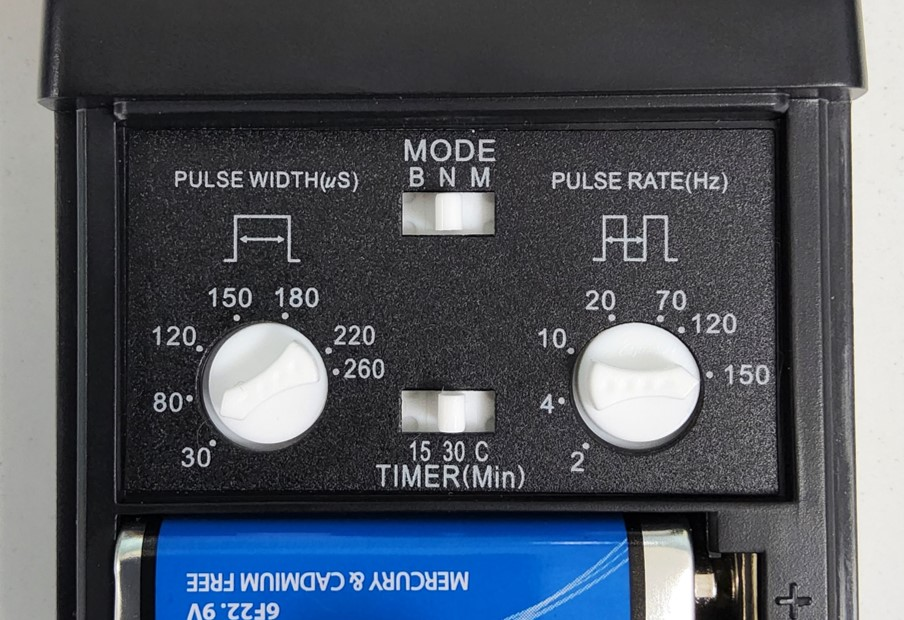
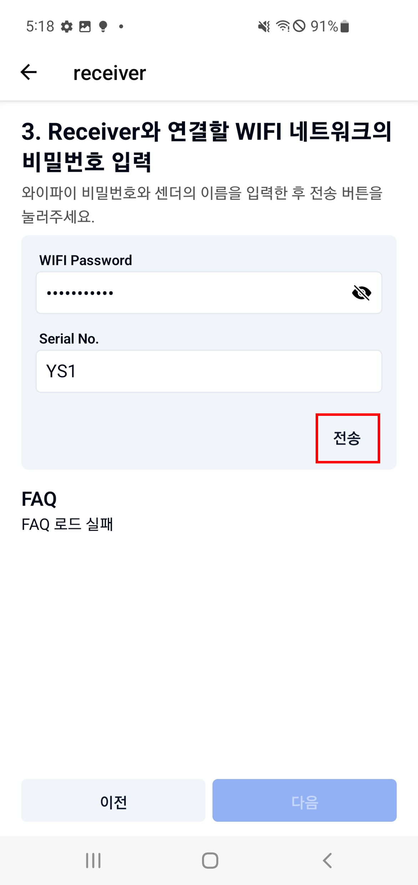

# HumanIN 사용설명서 2024

<aside>
    
## 💡 About HumanIN

- **Feature**
    
    HumanIN은 Sender 사용자의 EMG(Electromyography)가 임계값(Threshold)을 초과하는 순간을 포착하여 Wi-Fi를 통해 Receiver에게 신호를 보냅니다. 신호를 받은 Receiver는 연결된 TENS(Transcutaneous Electrical Nerve Stimulation, 경피 전기 신경 자극기)에 의한 전기 자극을 활성화시켜 Receiver 사용자의 근수축을 유도합니다.
    
- **Learn**
    
    Sender 사용자의 근수축 신호를 전달하여 Reciever 사용자에게 전달함으로써 근육을 자극하고 수축하는 방법을 배우게 됩니다.
    
- **Note**
    
    TENS는 근수축을 유발하는 강한 전기자극을 제공하기 때문에 목 또는 가슴 등 예민한 부위에 전극을 부착하면 위험합니다. 12세 미만 어린이는 보호자와 함께 사용하기를 권유합니다.
    
</aside>

---

## A. 구성품


1. HumainIn Case
2. Sender
3. Receiver 
4. TENS 3000 
5. TENS cable
6. TENS battery
7. Sender EMG cable
8. Sender EMG electrode pads
9. Receiver electrode pads
10. Mini screw driver
11. USB charger
12. 5Pin USB cable

## B. 기기 설정 방법

### 1. **Sender 설정**

<aside>
    
## ℹ️ 안내사항

- EMG Pad의 접착력이 약해졌다면 교체해 주도록 합니다.
- 센더 전원 공급을 위한 어댑터는 별도로 필요합니다.
</aside>

<p align="center"></p>

1. **5pin USB cable로 sender에 전원을 공급합니다.**

<p align="center"></p>

2. **EMG cable과 EMG electrode pad를 결합합니다.**

<p align="center"></p>

3. **Sender와 EMG cable을 연결합니다.**

<p align="center"></p>

4. **EMG electrode pad를 위의 사진과 같이 붙입니다. 흰색 (REF)은 손등, 나머지 빨간색 (VCC)와 검정색(GND)은 하완 안쪽에 붙여줍니다.**

### 2. **Receiver 설정**

<aside>
    
## ℹ️ 안내사항

- TENS Surface EMG Eletrode를 부착한 사람이 전기자극을 받아 근수축됩니다.
- **해당 리시버 설정 과정에서는 TENS3000과 리시버의 전원을 켜지 않도록 합니다.**
</aside>

<p align="center"></p>

1. **5pin USB cable로 receiver에 전원을 공급합니다.**

<p align="center"></p>

2. **TENS Cable에 Surface EMG Electrode를 결합합니다.**

<p align="center"></p>

3.  **TENS Cable을 TENS 3000의 왼쪽 단자에 연결합니다.**

<p align="center"></p>

4. **TENS Surface EMG Electrode 위의 사진과 같이 사용자의 상완과 하완에 각각 한개씩 부착합니다.**

<p align="center"></p>

5. **TENS Cable을 Receiver에 삽입 후 동봉된 드라이버로 Receiver 상단의 나사를 조여 고정합니다.**

### 3. **TENS 설정**

<aside>
    
## ℹ️ 안내사항

TENS3000의 설정값은 개인에 따라 최적화 된 값이 다릅니다. **최솟값부터 천천히 Power를 올려가며** 테스트해보길 권장드립니다.

</aside>

<p align="center"></p>

1. **TENS 3000에 동봉된 건전지를 삽입합니다.**

<p align="center"></p>

2. **TENS 3000 설정 값을 조정합니다.** 

<aside>
ℹ️ **추천값**

```
Pulse Rate = 150Hz
Pulse Width = 30 - 80 μs
```

</aside>

<p align="center"></p>

1. **설정 중에 전류가 공급되지 않도록 “E. 앱과 Receiver 연결” 과정까지 모두 완료된 후에  TENS Cable이 연결된 왼쪽 상단 다이얼을 돌려 세기 조절 및 전원을 켭니다.**

## C. 앱 최초 설정

1. 앱의 블루투스 검색을 허용합니다. 

<p align="center"></p>


2. 앱의 메인 화면은 아래 사진과 같습니다. 

<p align="center"></p>


## D. 앱과 Sender 연결

### 1. Sender와 앱을 블루투스로 연결

1. Sender의 전원을 연결한 뒤, 하단의 파란색 동그라미를 눌러 ‘Sender 연결하기’ 버튼을 누릅니다. 

<p align="center"></p>

2. ‘다음’ 버튼을 누릅니다.

<p align="center"></p>

3. 연결할 Sender의 시리얼 넘버를 선택합니다.

<p align="center"></p>

4. Sender 연결이 완료되면 아래와 같이 표시됩니다.

<p align="center"></p>

### 2. Sender 차트 확인 및 임계값 설정

1. Sender  차트에 표시되는 빨간색 선은 임계값을 나타냅니다. 

<p align="center"></p>

2. 송신자가 팔을 움직여 임계값 이상의 신호를 발생시키면 수신자에게 전극이 전송됩니다.
    
    <p align="center"></p>    

3. 새로운 임계값을 입력 후 ‘전송’ 버튼을 누르면 임계값을 변경할 수 있습니다. 
    
<p align="center"></p>

## E. 앱과 Receiver 연결

### 1. 앱과 Receiver의 와이파이 연결하기

1. Receiver 전원을 연결한 뒤  하단의 파란색 동그라미를 눌러 ‘Receiver 연결하기’ 버튼을 누릅니다.

<p align="center"></p>

2. ‘와이파이 설정 페이지로 이동’ 버튼을 누릅니다.

<p align="center"></p>

3. 와이파이 설정창에서 Receiver에 의해 생성된 SSID에 연결합니다 (G-BRAIN_시리얼 코드).
    - 비밀번호는 `gbrain0814` 입니다.
    
<p align="center"></p>

4. 인터넷 연결 관련 안내창이 표시되면  ‘이번만 연결’ 혹은 ‘항상 연결’을 누릅니다. 

<p align="center"></p>

5. 와이파이 설정창에서 ‘인터넷에 연결되어 있지 않음’이라고 표시되어도 정상 상태입니다.
6. 아래 화면 상태에서 되돌아가기 버튼을 눌러 앱 화면으로 돌아갑니다. 

<p align="center"></p>

### 2. Receiver가 신호를 수신할 와이파이 연결하기

1. Receiver와 연결할 와이파이 및 핫스팟 네트워크를 선택합니다. 

<p align="center"></p>

2. 선택 후 하단의 ‘다음’ 버튼을 누릅니다.

<p align="center"></p>

3. 선택한 와이파이 및 핫스팟 네트워크의 비밀번호를 입력합니다.
4. 구독할 Sender의 시리얼 번호를 입력합니다.
5. 이후 하단의 ‘전송’ 버튼을 누릅니다. 

    <p align="center"></p>    

6. Receiver 연결이 완료되면 아래와 같이 표시됩니다

<p align="center"></p>

### 3. 앱과 서버 연결하기

1. ‘와이파이 설정 페이지로 이동’ 버튼을 누릅니다.

 
<p align="center"></p>

2. 앱과 연결할 와이파이 및 핫스팟 네트워크를 선택합니다. 
3. 아래 화면 상태에서 되돌아가기 버튼을 눌러 앱 화면으로 돌아갑니다. 

    <p align="center"></p>

4. 앱 화면 우측 상단의 ‘MQTT 서버 재연결’ 버튼을 누릅니다.

<p align="center"></p>

5. 앱과 서버가 연결되면 아래와 같이 ‘서버 연결됨’ 이 표시됩니다.

<p align="center"></p>

### 호환되는 기기 버전

🍎 IOS : 12.4 이상

🤖 Android : 5.0 이상

### 유의사항

- TENS 3000 주의사항을 확인하시오.
- HumanIN 기기는 인터넷 연결이 가능한 2.4GHz Wi-Fi 환경에서 작동합니다.
- 전기 자극을 이용한 제품이기에 민감한 신체 부위의 사용을 금지합니다.
- Sender 또는 Receiver의 LED가 꺼져있다면, 해당 기기의 전원을 껐다 켭니다.
- 보드에는 HumanIn 코드가 업로드 되어있습니다. 다른 프로젝트에 보드를 사용할 경우 코드를 다시 업로드하여야 합니다. 업로드는 아두이노 소프트웨어(Arduino IDE)를 통해 직접 하실 수 있습니다.
- 기기 초기화 버튼을 누른 후 다시 시도해보세요.
- 안드로이드 버전을 사용하는 경우, 여러 번 연결을 시도해야 할 수도 있습니다.
