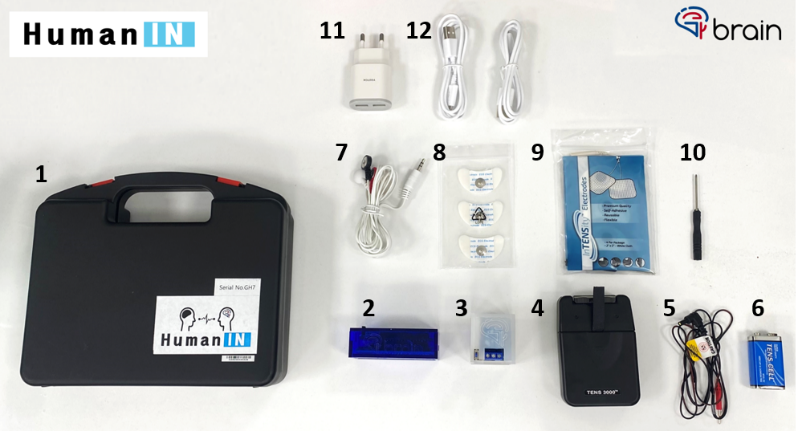

# HumainIN 프로젝트

HumainIN 프로젝트는 근전도(EMG) 데이터를 수집하고 이를 시각적으로 표시하며, MQTT 프로토콜을 통해 원격으로 전송할 수 있는 교육용 프로젝트입니다. 이 프로젝트는 두 개의 주요 아두이노 코드 파일로 구성되어 있습니다: `receiver.ino`와 `sender.ino`. 


## 프로젝트 개요

- **Receiver**: WiFi 네트워크에 연결하고 MQTT 브로커에 구독하며, 수신한 메시지에 따라 릴레이를 제어합니다.
- **Sender**: BLE(Bluetooth Low Energy)를 통해 EMG 데이터를 읽고 전송합니다. 특정 조건을 충족하면 MQTT 메시지를 보냅니다.

## 하드웨어 요구사항

- ESP8266 보드
- 아두이노 보드
- 근전도 센서
- 릴레이 모듈



## Arduino Library 요구사항

- Arduino IDE
- PubSubClient 라이브러리
- ESP8266WiFi 라이브러리
- ArduinoJson 라이브러리
- ESP8266WebServer 라이브러리
- BLEDevice 라이브러리 (ESP32)

## 설치 및 설정

### 1. Arduino IDE 설정

아두이노 IDE에서 ESP8266 보드 매니저를 설치하고 적절한 보드를 선택합니다. 필요한 라이브러리를 설치합니다.

```bash
Sketch > Include Library > Manage Libraries
```

필요한 라이브러리를 검색하고 설치합니다:
- PubSubClient
- ESP8266WiFi
- ArduinoJson
- ESP8266WebServer
- BLEDevice (ESP32)

### 2. Receiver 설정

`receiver.ino` 파일을 Arduino IDE에서 엽니다. 필요한 설정을 수정합니다.

- Tools → Upload Speed → 115200로 설정
- file → Preferences에 간 후 Additional boards maneger URLs에 아래의 URL 입력
```javascript
http://arduino.esp8266.com/stable/package_esp8266com_index.json
```
- Tools → Board → esp8266 → LOLIN(WEMOS) D1 R2 & mini 선택


```cpp
const char* ssid = "G-BRAIN_GH7";         /// WiFi SSID
const char* password = "HumainIN0814";      /// WiFi Password
const char* mqttServer = "61.101.55.94";  /// MQTT Broker IP
const int mqttPort = 1883;                /// MQTT Port
const char* mqttClientID = "GH7_receiver";  /// MQTT Client ID
const String topic = "GH7";                /// MQTT Topic
```

### 3. Sender 설정

`sender.ino` 파일을 Arduino IDE에서 엽니다. 필요한 설정을 수정합니다.

- Tools → Upload Speed → 115200로 설정
- file → Preferences에 간 후 Additional boards maneger URLs에 아래의 URL 입력
```javascript
https://dl.espressif.com/dl/package_esp32_index.json
```
- Tools → Board → esp32 → LOLIN D32 PRO 선택

```cpp
String deviceName = "GH7";  // 블루투스 이름
double limit = 155;         // 데이터 전송 임계값
```

### 4. 업로드 및 실행

각 코드 파일을 해당하는 보드에 업로드합니다. 

1. **Receiver** 코드를 ESP8266 보드에 업로드합니다.
2. **Sender** 코드를 Arduino 보드에 업로드합니다.

### 5. WiFi 및 MQTT 설정

#### Receiver 설정

1. ESP8266 보드를 부팅합니다.
2. WiFi 네트워크(G-BRAIN_GH7)에 연결합니다.
3. 브라우저에서 `192.168.4.1`로 접속합니다.
4. 사용자의 WiFi SSID, Password, Topic을 입력하고 저장합니다.
5. Receiver 보드는 MQTT 브로커에 연결됩니다.

#### Sender 설정

1. 블루투스 장치(GH7)에 연결합니다.
2. 근전도 데이터를 수집하고 지정된 임계값을 초과하면 데이터를 전송합니다.

### 6. MQTT 브로커 설정

MQTT 브로커가 필요합니다. 로컬 또는 클라우드 MQTT 브로커를 설정할 수 있습니다.

## 작동 방식

### Receiver

1. Receiver 보드는 WiFi에 연결된 후 MQTT 브로커에 연결됩니다.
2. MQTT 토픽을 구독합니다.
3. 메시지를 수신하면 릴레이를 제어합니다.

### Sender

1. Sender 보드는 BLE를 통해 EMG 데이터를 수집합니다.
2. 이동 평균 필터를 적용하여 데이터를 평활화합니다.
3. 특정 임계값을 초과하면 데이터를 전송합니다.

## 코드 설명

### Receiver 코드 (`receiver.ino`)

- **WiFi 연결 및 설정**: `handleWiFiConnect()` 함수는 WiFi 연결을 설정합니다.
- **MQTT 연결 및 구독**: MQTT 서버에 연결하고 주제를 구독합니다.
- **LED 제어**: `blinkLED()` 함수는 LED를 깜빡입니다.
- **서버 설정**: `setup()` 함수는 서버를 설정하고 핀 모드를 구성합니다.
- **루프**: `loop()` 함수는 클라이언트 요청을 처리하고 MQTT 메시지를 수신합니다.

### Sender 코드 (`sender.ino`)

- **BLE 설정**: BLE 장치를 초기화하고 서비스 및 특성을 설정합니다.
- **데이터 수집**: `readDataStream()` 함수는 EMG 데이터를 읽고 이동 평균 필터를 적용합니다.
- **데이터 전송**: BLE를 통해 데이터를 전송하고 MQTT 메시지를 보냅니다.

## 사용 예제

1. ESP8266 보드를 부팅하고 WiFi 네트워크에 연결합니다.
2. Arduino 보드를 부팅하고 BLE 장치에 연결합니다.
3. EMG 데이터를 수집하고 시각적으로 표시합니다.
4. 특정 임계값을 초과하면 MQTT 메시지를 전송합니다.
